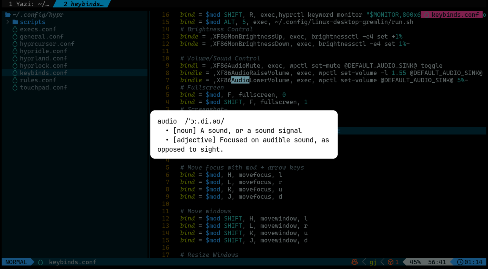

---

# **hyprdict — Instant Dictionary Popup for Hyprland**

> Select a word → get a definition popup. No extra steps.

---

## ✨ Features

- ⚡ Instant popup on text selection (no hotkey needed)
- 🌐 English support via `dictionaryapi.dev`
- 🇯🇵 Japanese support via Jisho API
- 🪶 Lightweight (bash + rofi + curl)
- 🧠 Works with Zathura, browsers, terminals, etc.
- 🔁 Toggle on/off anytime

---

## 📸 Preview

>



---

## ⚙️ How It Works

```
Selection / Clipboard
        ↓
 dict_watch.sh (daemon)
        ↓
 dict_popup.sh
        ↓
   rofi popup
```

- Watches **PRIMARY selection** (mouse select)
- Watches **clipboard** (for apps like Zathura)
- Auto-detects language → fetches definition → shows popup

---

## 📦 Dependencies

Install on Arch:

```bash
sudo pacman -S rofi wl-clipboard curl python libnotify
```

---

## 🚀 Installation

### AUR (recommended)

```bash
yay -S hyprdict
```

---

### Manual

```bash
git clone https://aur.archlinux.org/hyprdict.git
cd hyprdict
makepkg -si
```

---

## 🛠 Setup

Add to your Hyprland config:

```ini
bind = SUPER, L, exec, hyprdict-toggle
```

or whatever keybinding you prefer.

Reload:

```bash
hyprctl reload
```

---

## 🎮 Usage

| Action        | Result        |
| ------------- | ------------- |
| `SUPER + L`   | Toggle on/off |
| Select word   | Popup appears |
| Copy text     | Popup appears |
| `Esc` / click | Close popup   |

## 💡 Notes

- Designed for **Hyprland (Wayland)**
- Not a plugin — uses clipboard monitoring
- Works best with keyboard-driven workflows

---

## 📄 License

## MIT
